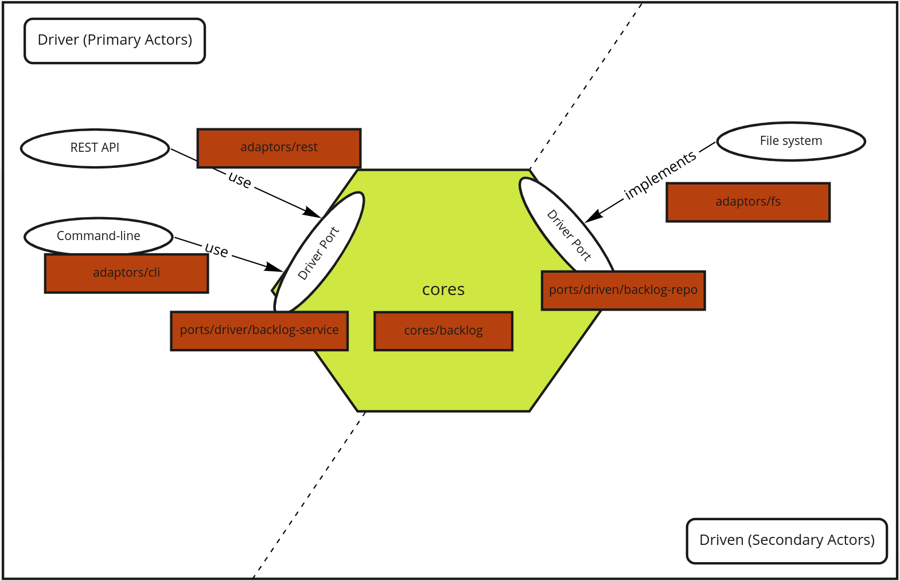

# rjira

This is an example of Hexagonal Architecture built by Rust.
Sample application like about JIRA.

The core features are simple as follows.

- Add the item (Story | Task) to backlog.
- Estimate the item by story point.
- Assign the item to someone.

Users can use the features through REST api or command-line app.

TODO:

- [ ] Think of a better method of error handling.
  - [ ] and remove the codes using `unwrap`
- [ ] Add logging (using tracing crate)
- [ ] More testing (ex: adaptors)

## Architecture

This application is built by multiple crates.



### cores/backlog

Cores represent the business domain.
In this case, the core has knowledge of backlog and backlog items.

- What is backlog item?
- What behavior does backlog item have?
- What is backlog?
- What behavior does backlog have?

I try to define data and behavior as separated using trait.

Users treat 2 kind of items (Story and Task).
These items are strictly different but have similar behavior.
These are estimated, assigned, ...etc.

Therefore, I define some traits that represent behavior.

For example, `Estimatable` trait means that something can be estimated.
I gave this trait to `Story` and `Task`.

By separating the behavior and the data gave me to be simple one by one.

(I often used trait object in this application.
However, it is possible to make similar expressing using enum.
trait object sometimes confused me more than necessary.)

#### Code sample

Define with default implementations.

```rust
pub trait Estimatable {
    fn mut_point(&mut self) -> &mut Option<StoryPoint>;

    /// estimate it.
    fn estimate(&mut self, point: StoryPoint) {
        *self.mut_point() = Some(point);
    }
}
```

When it implements, I can omit implementation.

```rust
impl Estimatable for Story {
    fn mut_point(&mut self) -> &mut Option<StoryPoint> {
        &mut self.point
    }
}
```

```rust
impl Estimatable for Task {
    fn mut_point(&mut self) -> &mut Option<StoryPoint> {
        &mut self.point
    }
}
```

We can test only the estimate part.

```rust
#[test]
fn test_estimatable() {
    let mut estimatable = TestEstimateable { point: None };
    estimatable.estimate(StoryPoint::new(2).unwrap());
    assert_eq!(estimatable.point, Some(StoryPoint::new(2).unwrap()))
}
```

### ports/***

Ports represent interfaces of application.
I define 2 kinds of interfaces called `Driver` and `Driven`.

#### Driver

`Driver` represents the interface that the actor of the application user.
In other words, `Driver` interface knows
how to call the function that is defined cores/backlog.

#### Driven

`Driven` represent the interface that application use.
Application often use middleware for persistencing and more.
These interfaces know that how to use it.

##### Code sample

Driver

Rust's trait can be defined default implementation.
So, unlike `Driven` interface, it is defined with default implementations.

The interface has dependencies to `Driven` interface.
So When we want to run `Driver` interface,
we can run with something that implement `Driven` interface.

Therefore, When we testing, we can use mock that was implemented `Driven`.

```rust
#[async_trait::async_trait]
pub trait BacklogUseCase: ProvideBacklogRepository {
    async fn get_backlog(&self) -> UseCaseResult<Backlog> {
        let repo = self.provide();
        let backlog = repo.get().await?;
        Ok(backlog)
    }

    /// Add item to backlog
    async fn add_item(&self, cmd: impl AddItemCmd + 'async_trait) -> UseCaseResult<Backlog> {
        let repo = self.provide();
        let mut backlog = repo.get().await?;
        backlog.add_item(cmd.item());
        repo.save(backlog.clone()).await?;
        Ok(backlog)
    }

    /// Assign the specific item to someone.
    async fn assign_item(&self, cmd: impl AssignItemCmd + 'async_trait) -> UseCaseResult<Backlog> {
        let repo = self.provide();
        let mut backlog = repo.get().await?;
        backlog.assign_item(&cmd.id(), cmd.assignee())?;
        repo.save(backlog.clone()).await?;
        Ok(backlog)
    }

    /// Estimate the specific item.
    async fn estimate_item(
        &self,
        cmd: impl EstimateItemCmd + 'async_trait,
    ) -> UseCaseResult<Backlog> {
        let repo = self.provide();
        let mut backlog = repo.get().await?;
        backlog.estimate_item(&cmd.id(), cmd.point())?;
        repo.save(backlog.clone()).await?;
        Ok(backlog)
    }
}
```

We can test it using mock

```rust
#[cfg(test)]
mod test_get_backlog {
    use super::*;

    #[tokio::test]
    async fn test_get_backlog() {
        let mut mock = mock::MockTest::new();
        mock.expect_get().times(1).returning(|| Ok(Backlog::new()));
        mock.get_backlog().await.unwrap();
    }
}
```

Driven

`Driven` interface is defined with `Provide~` trait.

```rust
pub trait ProvideBacklogRepository {
    type Repository: BacklogRepository + Send + Sync;

    fn provide(&self) -> &Self::Repository;
}

#[async_trait::async_trait]
pub trait BacklogRepository {
    /// Get the specific backlog.
    ///
    /// If backlog does not find, return the error.
    async fn get(&self) -> PortsResult<Backlog>;

    /// Save the specific backlog.
    async fn save(&self, backlog: Backlog) -> PortsResult<()>;
}
```

### adaptors/***

### applications/***

## How to use

### rest-server

Start server

```sh
❯ cargo run --bin rest-server
```

Add item

```sh
curl --location --request POST 'localhost:3000/backlog/items' \
--header 'Content-Type: application/json' \
--data-raw '{
    "item_type": "Task",
    "title": "test"
}'
```

Estimate item

```sh
curl --location --request PUT 'localhost:3000/backlog/items/<item_id>' \
--header 'Content-Type: application/json' \
--data-raw '{
    "point": 1,
}'
```

Assign item

```sh
curl --location --request PUT 'localhost:3000/backlog/items/<item_id>' \
--header 'Content-Type: application/json' \
--data-raw '{
    "assignee": "someone",
}'
```

### command-line

Show help

```sh
❯ cargo run --bin rjira -- --help
```

Add item

```sh
❯ cargo run --bin rjira -- add-item Story test
```

Estimate item

```sh
❯ cargo run --bin rjira -- estimate-item <ID> <POINT>
```

Assign item

```sh
❯ cargo run --bin rjira -- assign-item <ID> <ASSIGNEE>
```
